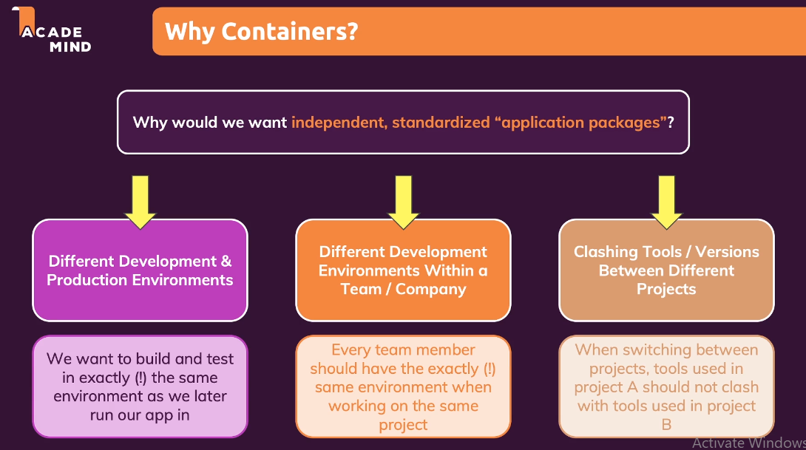
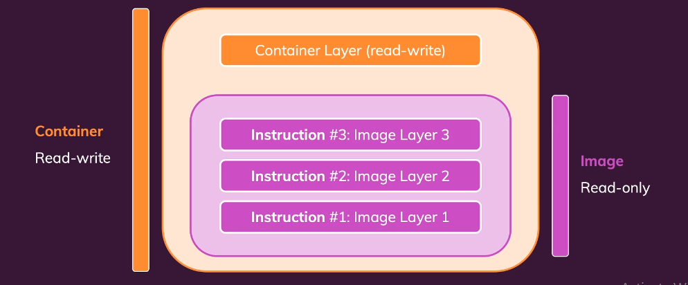
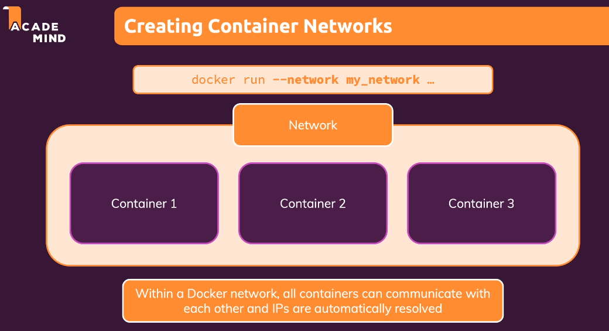
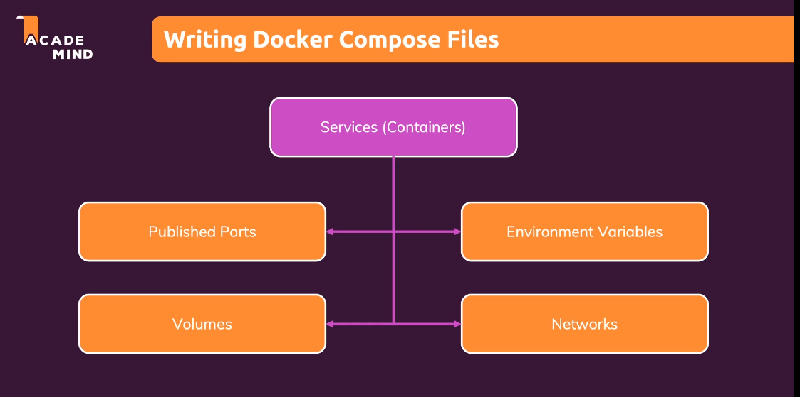

# Docker Handwritten

```bash
1)  **Docker**– A docker is a tool for creating and managing containers 
2)  **Docker Compose** – Managing more complex and multi container easier
3)  **docker run -p 3000:3000 imagename - the -p flag is used to publish a container's port(s) to the host.** **3000:3000 means that port 3000 on the host machine is being mapped to port 3000 inside the Docker container.**
4)  **Docker ps(process) -** to list running container
```

5) **CMD VS RUN** — `RUN` executes at image build time; `CMD` executes when the container starts. Without `CMD`, the base image's `CMD` runs. No base image and no `CMD` → error.

6) Every Dockerfile instruction creates a cached layer; changing one layer invalidates all subsequent layers (rebuild).

7) Data that must survive container removal requires **volumes**.

8) **Volumes** — host folders mounted into containers, managed by Docker (path hidden). Two types: **named** and **anonymous**.

9) **Named volumes** — survive container removal; use for persistent data.

10) **Anonymous volumes** — tied to a container; for temporary in-container data.

11) **Bind mounts** — user-specified host folders mounted into containers (like named volumes). No image rebuild needed for dev code changes — container sees latest code.

12) Docker supports **build-time arguments** (`ARG`) and **runtime environment variables** (`ENV`).

```bash
13) **Host.docker.internal** – this will be translated to ipadress of your local host machine as seen from inside the container
```

14) Frontend, backend, and database containers can communicate via published `localhost` ports, or directly through a shared **network**.

```bash
15) **Network** - 
```

16) Container names auto-resolve to IP addresses when containers share the same network.

```bash
17) **Docker Compose** – Its is used to manage multiple containers on same host but not suitable for managing multiple containers on different hosts(machine). The idea is basically to replace long lengthy docker run command with docker compose file for multiple container.
18) **Docker exec** – docker exec commands allows you to run additional command besides from the cmd written in dockerfile
19) If you specify command in docker run command after the image name, then **cmd** command in dockerfile will be overwritten
20) **Entrypoint command -** If you specify command in docker run command after the image name, then that command will be appended with entrypoint command mentioned in dockerfile
```

21) Bind mounts should not be used in production.

22) **SSH** — `sudo` ensures the command runs as root / with sufficient permissions.

23) **Multi-stage Builds** — separate build and deploy stages in one Dockerfile (e.g., Angular build → nginx deploy). Copy artifacts between stages; use `--target` to stop at a specific stage.
