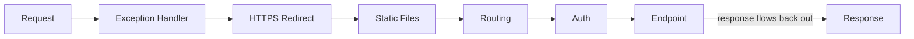

# The Middleware Pipeline

## Concept Explanation

In ASP.NET Core, every HTTP request flows through a **pipeline of middleware** components. Each middleware can:
1. Run logic **before** passing to the next component,
2. Call `next()` to invoke the rest of the pipeline,
3. Run logic **after** the response comes back.

The order of registration **matters** — it defines the request (in) and response (out) order, like nested layers (an "onion" / Russian-doll model). A middleware can **short-circuit** by not calling `next()` (e.g. authentication failing, static file found).



## Code Example(s)

```csharp
var app = builder.Build();

// ORDER MATTERS — request flows top-down, response bottom-up
app.UseExceptionHandler("/error"); // first → catches downstream errors
app.UseHttpsRedirection();
app.UseStaticFiles();
app.UseRouting();
app.UseAuthentication();           // who are you?  (before authorization)
app.UseAuthorization();            // are you allowed?
app.MapControllers();              // endpoint (terminal)

app.Run();
```

```csharp
// Inline custom middleware
app.Use(async (context, next) =>
{
    var sw = System.Diagnostics.Stopwatch.StartNew();
    await next();                              // call the rest of the pipeline
    Console.WriteLine($"{context.Request.Path} took {sw.ElapsedMilliseconds}ms");
});

// Terminal middleware (short-circuits — never calls next)
app.Run(async context => await context.Response.WriteAsync("End"));
```

## Interview Q&A

**🟢 What is middleware in ASP.NET Core?**
Components assembled into a pipeline that process HTTP requests and responses. Each can act before/after the next component or short-circuit the pipeline.

**🟢 Why does middleware order matter?**
Because each middleware wraps the next. For example, authentication must run before authorization, and exception handling must be early to catch downstream errors.

**🟡 Difference between `Use`, `Run`, and `Map`?**
`Use` adds middleware that can call the next one. `Run` adds a terminal middleware that never calls next (ends the pipeline). `Map`/`MapWhen` branches the pipeline based on path/condition.

**🟡 What's the difference between middleware and a filter?**
Middleware operates on every request at the framework level (before MVC). Filters (`IActionFilter`, etc.) run inside the MVC pipeline around action execution and have access to MVC context (model state, action arguments).

**🔴 How would you short-circuit the pipeline?**
By not calling `next()` — e.g. returning a 401 from auth middleware, or serving a cached/static response. Control returns back up the already-executed middleware.

## ⚠️ Tricky / Gotchas

- **`UseAuthentication` must come before `UseAuthorization`**, and both after `UseRouting` (so the endpoint is known). Wrong order → auth silently doesn't apply.
- **Writing to the response after calling `next()` may fail** if the response has already started (headers sent). Check `context.Response.HasStarted`.
- **CORS, routing, auth ordering** is a frequent source of "it works locally but 401s in prod" bugs.
- **Middleware is singleton-ish**: the middleware instance is constructed once. To use scoped services, inject them into the `Invoke`/`InvokeAsync` method, not the constructor.

## 📌 Quick Recap

- Middleware = ordered pipeline; each wraps the next (onion model).
- Order matters: ExceptionHandler → HTTPS → Static → Routing → AuthN → AuthZ → Endpoints.
- `Use` (can call next), `Run` (terminal), `Map` (branch).
- Short-circuit by not calling `next()`.
- Inject scoped services into `InvokeAsync`, not the middleware constructor.
