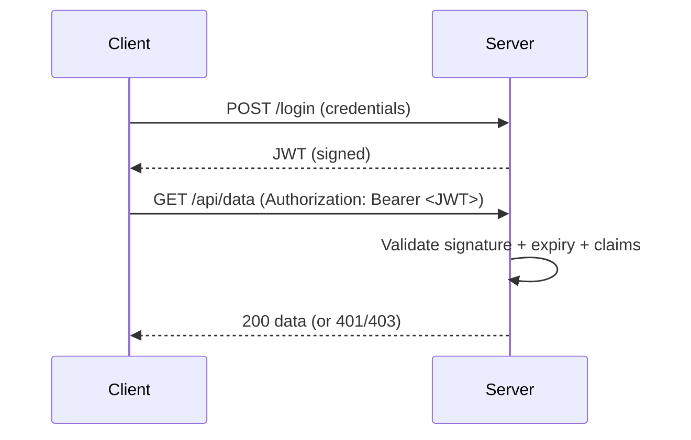

# Authentication vs Authorization & JWT

## Concept Explanation

- **Authentication (AuthN)** — *who are you?* Verifying identity (login with credentials, tokens, cookies).
- **Authorization (AuthZ)** — *what are you allowed to do?* Checking permissions/roles/policies after identity is established.

A **JWT (JSON Web Token)** is a compact, self-contained, signed token used for stateless authentication in APIs. It has three Base64URL parts: **header.payload.signature**. The payload holds **claims** (user id, roles, expiry). The server validates the signature (and expiry) without storing session state.



## Code Example(s)

```csharp
// Configure JWT bearer authentication
builder.Services.AddAuthentication(JwtBearerDefaults.AuthenticationScheme)
    .AddJwtBearer(options =>
    {
        options.TokenValidationParameters = new TokenValidationParameters
        {
            ValidateIssuer = true,
            ValidateAudience = true,
            ValidateLifetime = true,           // reject expired tokens
            ValidateIssuerSigningKey = true,
            IssuerSigningKey = new SymmetricSecurityKey(
                Encoding.UTF8.GetBytes(builder.Configuration["Jwt:Key"]!))
        };
    });

builder.Services.AddAuthorization(options =>
    options.AddPolicy("AdminOnly", p => p.RequireRole("Admin")));
```

```csharp
[Authorize]                                   // must be authenticated
[ApiController, Route("api/[controller]")]
public class OrdersController : ControllerBase
{
    [HttpGet] public IActionResult GetMine() => Ok();

    [Authorize(Roles = "Admin")]              // role-based
    [HttpDelete("{id}")] public IActionResult Delete(int id) => NoContent();

    [Authorize(Policy = "AdminOnly")]         // policy-based
    [HttpGet("all")] public IActionResult All() => Ok();

    [AllowAnonymous]                          // opt out of [Authorize]
    [HttpGet("public")] public IActionResult Public() => Ok();
}
```

## Interview Q&A

**🟢 What's the difference between authentication and authorization?**
Authentication verifies *who* you are; authorization decides *what* you're allowed to do. AuthN comes first, then AuthZ.

**🟢 What is a JWT?**
A signed, self-contained token (header.payload.signature) carrying claims about the user. The server validates its signature and expiry to authenticate stateless requests — no server-side session needed.

**🟡 Why use JWT over cookies/sessions?**
JWTs are stateless and scale horizontally (no shared session store), and work well across services/APIs and mobile clients. Cookies are simpler for browser apps and easier to revoke.

**🟡 What's the difference between role-based and policy-based authorization?**
Role-based checks membership in a role (`[Authorize(Roles="Admin")]`). Policy-based is more flexible — you define named policies with requirements (claims, custom handlers) and apply them (`[Authorize(Policy="...")]`).

**🔴 What are the security concerns with JWTs?**
They can't be easily revoked before expiry (mitigate with short lifetimes + refresh tokens or a denylist). Never put secrets in the payload (it's only Base64-encoded, not encrypted). Always validate signature, issuer, audience, and expiry; store the signing key securely.

## ⚠️ Tricky / Gotchas

- **JWT payload is NOT encrypted** — it's Base64URL-encoded and readable by anyone. Don't store sensitive data there; the signature only guarantees *integrity*, not confidentiality.
- **`UseAuthentication` before `UseAuthorization`** in the pipeline — and both after `UseRouting`. Wrong order → `[Authorize]` doesn't work.
- **401 vs 403**: 401 Unauthorized = not authenticated (no/invalid token); 403 Forbidden = authenticated but lacks permission. People mix these up.
- **Revocation is hard** — once issued, a JWT is valid until it expires. Use short-lived access tokens + refresh tokens.
- **Clock skew**: token expiry checks allow a small default skew (5 min); set it explicitly if needed.

## 📌 Quick Recap

- AuthN = who you are; AuthZ = what you can do (AuthN first).
- JWT = signed header.payload.signature with claims; stateless, validated by signature + expiry.
- Payload is encoded, not encrypted — no secrets inside.
- Pipeline: `UseAuthentication` → `UseAuthorization` (after `UseRouting`).
- 401 = not authenticated; 403 = authenticated but forbidden.
- Use role-based or policy-based `[Authorize]`; short-lived tokens + refresh for revocation.
