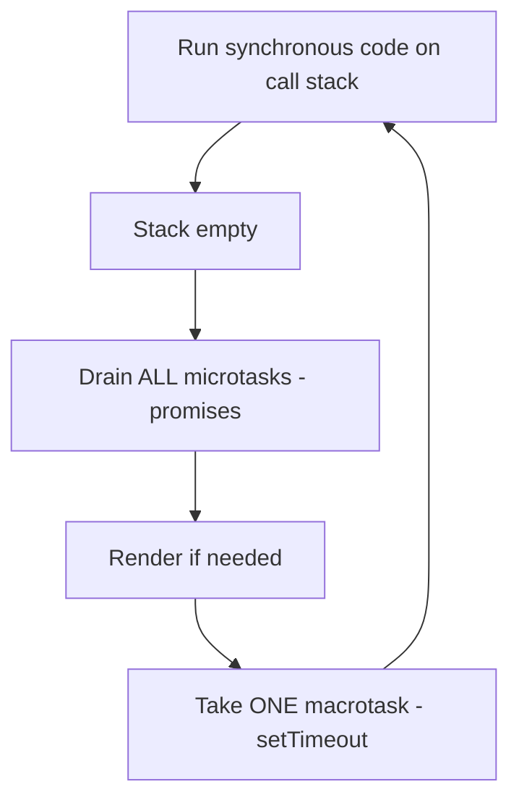

# The Event Loop: Microtasks vs Macrotasks

## Concept Explanation

JavaScript is **single-threaded** — it runs one piece of code at a time on the **call stack**. Asynchronous work (timers, network, promises) is handled by the **event loop**, which coordinates between the call stack and two queues:

- **Macrotask queue** (a.k.a. task queue): `setTimeout`, `setInterval`, I/O, UI events.
- **Microtask queue**: Promise callbacks (`.then`/`catch`/`finally`), `queueMicrotask`, `await` continuations, `MutationObserver`.

**The rule:** after each macrotask (and after the current synchronous code finishes), the event loop **drains the entire microtask queue** before rendering or picking up the next macrotask. So microtasks always run **before** the next macrotask.



## Code Example(s)

```javascript
console.log("1: sync start");

setTimeout(() => console.log("2: macrotask (setTimeout)"), 0);

Promise.resolve().then(() => console.log("3: microtask (promise)"));

console.log("4: sync end");

// Output order:
// 1: sync start
// 4: sync end
// 3: microtask (promise)   ← microtasks drain before macrotasks
// 2: macrotask (setTimeout)
```

```javascript
// async/await is microtask-based
async function run() {
  console.log("A");
  await null;                 // everything after await is a microtask
  console.log("C");
}
console.log("start");
run();
console.log("B");
// Output: start, A, B, C
```

## Interview Q&A

**🟢 Is JavaScript single-threaded?**
Yes — it executes on a single main thread with one call stack. Async behavior comes from the event loop and the host environment (browser/Node) APIs, not extra JS threads.

**🟢 What is the event loop?**
A mechanism that continuously checks: if the call stack is empty, it runs queued tasks. It processes microtasks fully, then one macrotask, repeating.

**🟡 What's the difference between microtasks and macrotasks?**
Microtasks (promise callbacks, `queueMicrotask`) run after the current task and before the next macrotask/render. Macrotasks (`setTimeout`, I/O, events) run one per loop iteration after microtasks drain.

**🟡 Does `setTimeout(fn, 0)` run immediately?**
No. It schedules `fn` as a macrotask that runs after the current synchronous code AND all pending microtasks complete — so at least after the current tick, often later.

**🔴 What happens if a microtask keeps adding more microtasks?**
The microtask queue must fully drain before the next macrotask/render, so an endlessly self-scheduling microtask can starve rendering and macrotasks (freeze the UI), whereas `setTimeout` recursion yields between tasks.

## ⚠️ Tricky / Gotchas

- **Promises always beat `setTimeout(…, 0)`** even with zero delay, because microtasks drain before the next macrotask.
- **`await` splits a function** — code after `await` is scheduled as a microtask, so it runs later than the synchronous code following the function call.
- **Order prediction questions** are extremely common. Remember: *sync → all microtasks → one macrotask → all microtasks → ...*

```javascript
console.log("a");
setTimeout(() => console.log("b"));
Promise.resolve().then(() => console.log("c")).then(() => console.log("d"));
console.log("e");
// a, e, c, d, b
```

- **`setTimeout` minimum delay** is clamped (≥4ms for nested timers in browsers), so "0" is never truly instant.
- **Node has extra phases** (`process.nexttick` runs even before promise microtasks; `setImmediate` vs `setTimeout` ordering differs) — mention if the role is Node-focused.

## 📌 Quick Recap

- JS is single-threaded; the event loop coordinates the call stack + queues.
- Microtasks (promises, `await` continuations) drain fully before each macrotask.
- Macrotasks (`setTimeout`, I/O, events) run one per loop iteration.
- `setTimeout(fn,0)` ≠ immediate; promises run before it.
- Predict order: sync → microtasks → one macrotask → repeat.
