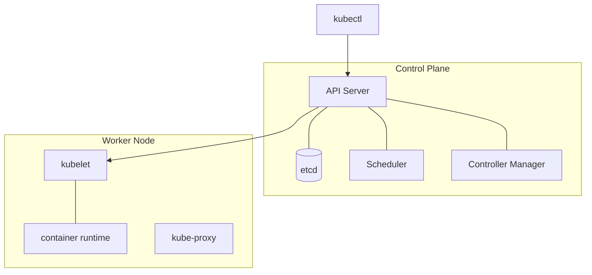

# Architecture: Control Plane & Nodes

## Concept Explanation

**Kubernetes (K8s)** is a container orchestration platform that automates deployment, scaling, and management of containerized apps across a **cluster** of machines. A cluster has two kinds of components:

**Control plane** (the "brain", decides desired state):
- **API server** — the front door; all communication (kubectl, components) goes through it.
- **etcd** — distributed key-value store holding all cluster state (the source of truth).
- **Scheduler** — assigns Pods to suitable nodes.
- **Controller manager** — runs control loops that drive actual state toward desired state.

**Worker nodes** (run your workloads):
- **kubelet** — agent that ensures containers in Pods are running.
- **kube-proxy** — handles networking/load balancing rules on the node.
- **Container runtime** — runs containers (containerd, CRI-O).

K8s is **declarative**: you describe the *desired state* (YAML), and controllers continuously **reconcile** reality to match it.



## Code Example(s)

```bash
kubectl get nodes               # list worker nodes
kubectl get pods -A             # all pods across namespaces
kubectl cluster-info            # control plane endpoints
kubectl describe node <name>    # node details / capacity / conditions
kubectl apply -f deploy.yaml    # declaratively create/update resources
```

```yaml
# Everything is a declarative object with apiVersion/kind/metadata/spec
apiVersion: v1
kind: Pod
metadata:
  name: nginx
spec:
  containers:
    - name: nginx
      image: nginx:1.27
```

## Interview Q&A

**🟢 What is Kubernetes and why use it?**
A container orchestrator that automates deploying, scaling, healing, and networking of containers across a cluster. It provides self-healing, rolling updates, service discovery, and declarative management.

**🟢 What are the main control-plane components?**
API server (entry point), etcd (state store), scheduler (places Pods), and controller manager (reconciliation loops). Sometimes cloud-controller-manager for cloud integration.

**🟡 What runs on a worker node?**
kubelet (ensures Pods/containers run and reports status), kube-proxy (networking rules), and a container runtime (containerd/CRI-O) that actually runs the containers.

**🟡 What does "declarative" mean in Kubernetes?**
You declare the desired end state in manifests; controllers continuously reconcile the actual state toward it, rather than you issuing imperative step-by-step commands.

**🔴 What is the role of etcd and why is it critical?**
etcd is the distributed, consistent key-value store that holds *all* cluster state and configuration. If etcd is lost without a backup, the cluster's state is lost — so it must be backed up and run in a fault-tolerant (odd-numbered quorum) setup.

## ⚠️ Tricky / Gotchas

- **kubectl talks only to the API server** — every component reads/writes state via the API server, which persists to etcd. Nothing bypasses it.
- **The scheduler only *places* Pods; kubelet *runs* them.** People conflate the two.
- **Desired vs actual state**: deleting a Pod managed by a Deployment recreates it — the controller reconciles back to the declared replica count. To truly remove it, delete the controlling object.
- **Control plane vs data plane**: control plane makes decisions; your app traffic flows through the data plane (kube-proxy/CNI). Don't run heavy workloads on control-plane nodes.
- **etcd is a single source of truth** — needs odd-number quorum (3/5) for HA and regular backups.

## 📌 Quick Recap

- K8s orchestrates containers across a cluster; declarative + self-healing.
- Control plane: API server (entry), etcd (state), scheduler (placement), controller manager (reconcile).
- Worker node: kubelet (runs Pods), kube-proxy (networking), container runtime.
- All communication goes through the API server → etcd.
- Controllers continuously reconcile actual state to desired state.
- Protect/back up etcd; it holds all cluster state.
