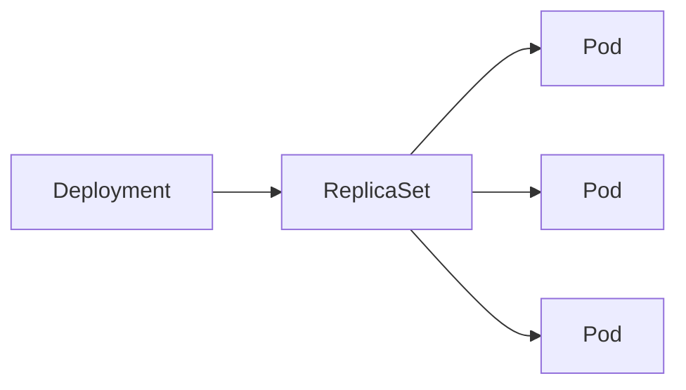

# Pods, ReplicaSets & Deployments

## Concept Explanation

- **Pod** — the smallest deployable unit in K8s: one or more containers that share a network namespace (same IP) and storage. Usually one app container per Pod (+ optional sidecars). Pods are **ephemeral** — they can be killed and rescheduled, getting a new IP.
- **ReplicaSet** — ensures a specified number of identical Pod **replicas** are running (self-healing: replaces failed Pods).
- **Deployment** — a higher-level controller that manages ReplicaSets, enabling **declarative updates**, **rolling updates**, and **rollbacks**. You almost always create Deployments, not bare Pods/ReplicaSets.



## Code Example(s)

```yaml
apiVersion: apps/v1
kind: Deployment
metadata:
  name: web
spec:
  replicas: 3                      # desired number of Pods
  selector:
    matchLabels: { app: web }      # which Pods this manages
  strategy:
    type: RollingUpdate            # zero-downtime updates
    rollingUpdate:
      maxUnavailable: 0
      maxSurge: 1
  template:                        # the Pod blueprint
    metadata:
      labels: { app: web }
    spec:
      containers:
        - name: web
          image: myapp:1.2.0
          ports: [{ containerPort: 80 }]
```

```bash
kubectl apply -f web.yaml
kubectl set image deployment/web web=myapp:1.3.0   # triggers rolling update
kubectl rollout status deployment/web
kubectl rollout undo deployment/web                # roll back to previous version
kubectl scale deployment/web --replicas=5
kubectl get pods -l app=web
```

## Interview Q&A

**🟢 What is a Pod?**
The smallest deployable unit — one or more tightly-coupled containers sharing the same network (IP) and storage. Containers in a Pod can reach each other on `localhost`.

**🟢 What's the difference between a Pod, a ReplicaSet, and a Deployment?**
A Pod runs containers. A ReplicaSet keeps N identical Pods running. A Deployment manages ReplicaSets to provide declarative rolling updates and rollbacks. You normally create Deployments.

**🟡 How does a rolling update work?**
The Deployment creates a new ReplicaSet and gradually shifts Pods from old to new (controlled by `maxSurge`/`maxUnavailable`), keeping the app available. If something breaks, you can roll back to the previous ReplicaSet.

**🟡 Why shouldn't you deploy bare Pods?**
A bare Pod isn't self-healing — if its node dies, nothing recreates it. Controllers (Deployment/ReplicaSet/StatefulSet) ensure the desired number of Pods is maintained.

**🔴 When would you use a StatefulSet or DaemonSet instead of a Deployment?**
**StatefulSet** for stateful apps needing stable network identities and ordered, persistent storage (databases). **DaemonSet** to run one Pod per node (log collectors, monitoring agents). **Deployment** is for stateless apps.

## ⚠️ Tricky / Gotchas

- **Pod IPs are not stable** — Pods get new IPs when rescheduled. Never hardcode Pod IPs; use a **Service** for a stable endpoint.
- **Labels/selectors must match** — the Deployment `selector` must match the Pod template `labels`, or it won't manage the Pods (or the API rejects it).
- **Deleting a Pod managed by a Deployment recreates it** — to remove, scale to 0 or delete the Deployment.
- **Multiple containers in a Pod share lifecycle and node** — use multi-container Pods only for tightly coupled helpers (sidecars), not separate services.
- **`kubectl edit`/imperative changes drift from your YAML** — prefer `kubectl apply` with version-controlled manifests (GitOps).

## 📌 Quick Recap

- Pod = smallest unit (shared network/storage); ephemeral, non-stable IP.
- ReplicaSet keeps N replicas (self-healing); Deployment manages ReplicaSets for rolling updates/rollbacks.
- Deploy Deployments, not bare Pods (self-healing + updates).
- Rolling update via `maxSurge`/`maxUnavailable`; `rollout undo` to revert.
- StatefulSet = stateful/ordered; DaemonSet = one per node; Deployment = stateless.
- Use Services for stable addressing; keep selectors/labels matched.
