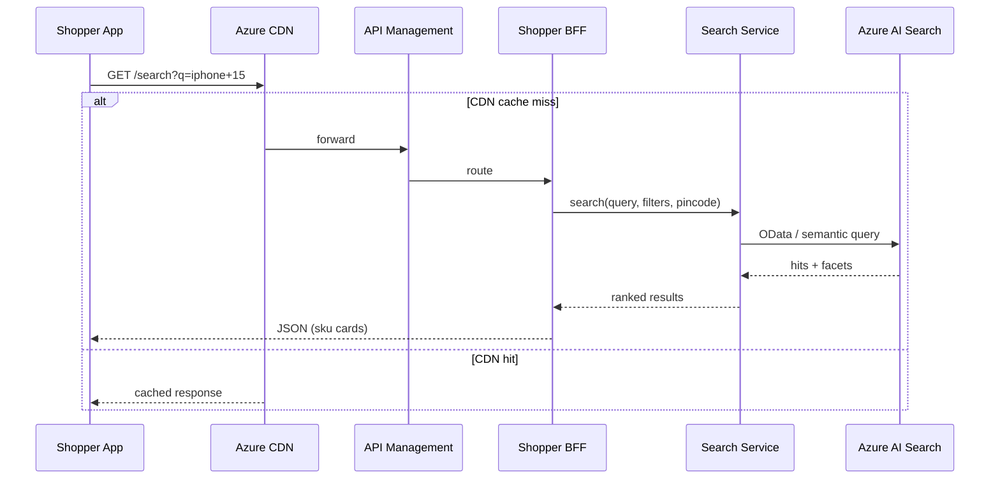
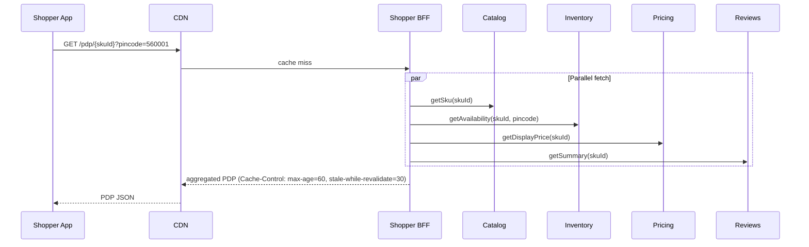
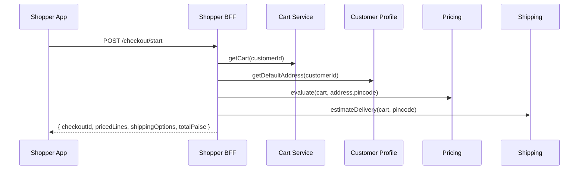
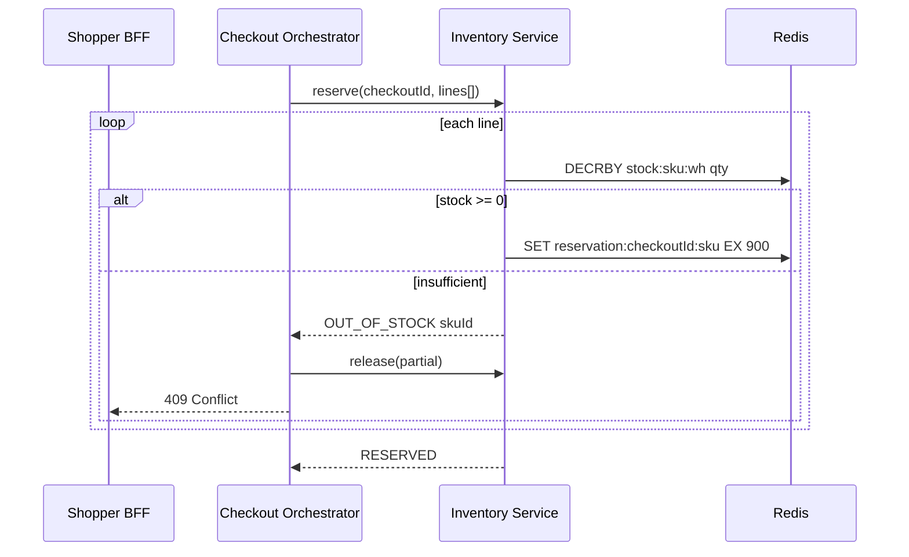
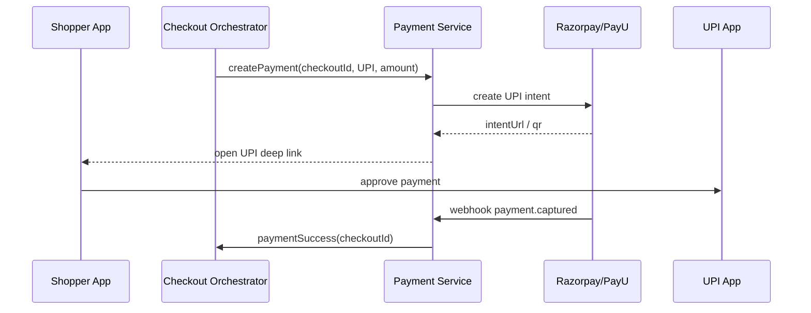
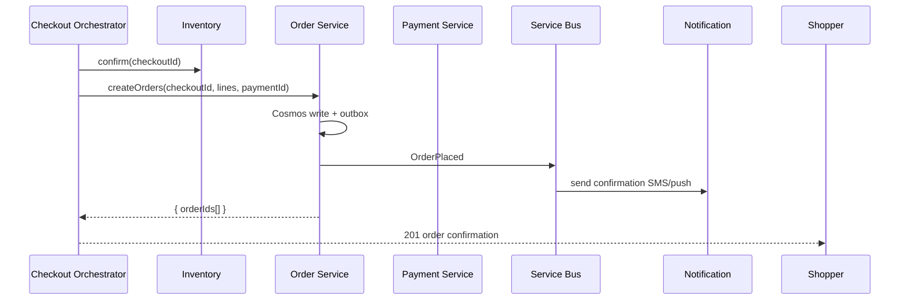
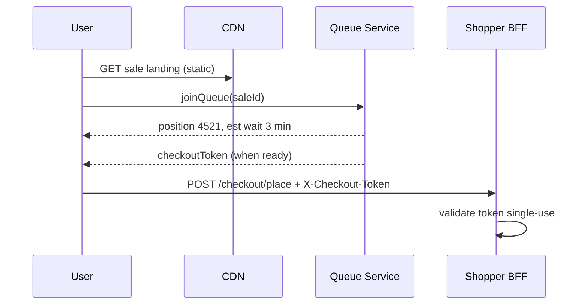

# E-Commerce Marketplace — Request Lifecycle and Integration Flows

| Field | Value |
|-------|-------|
| **Document ID** | ARCH-ECOM-003 |
| **Version** | 1.0 |
| **Parent** | ARCH-ECOM-001 |
| **Audience** | Integration engineers, QA, SRE, technical leads |

---

## Executive summary

This document traces **every system hop** from shopper discovery through delivery and returns. A marketplace purchase is a **multi-step distributed saga** spanning cart, inventory, payment, and fulfillment — not a single database transaction.

**Critical path:** Checkout placement must complete the synchronous portion (reserve inventory + initiate payment) within **2 seconds p99**. Search index updates, seller notifications, and analytics are asynchronous.

**Sale events** (FL-012) override normal paths with CDN pre-warming, checkout tokens, and inventory pre-allocation — documented separately because failure modes differ from steady-state.

---

## 1. Flow index

| Flow ID | Name | Trigger |
|---------|------|---------|
| FL-001 | Browse and search | User searches or browses category |
| FL-002 | Product detail page (PDP) | User opens product |
| FL-003 | Add to cart | User adds or updates cart |
| FL-004 | Apply coupon | User enters promo code |
| FL-005 | Checkout initiation | User proceeds to checkout |
| FL-006 | Inventory reservation | Checkout validates stock |
| FL-007 | Payment (UPI / card / COD) | User pays |
| FL-008 | Order confirmation | Payment success |
| FL-009 | Warehouse pick-pack-ship | Fulfillment triggered |
| FL-010 | Shipment tracking | Order in transit |
| FL-011 | Return and refund | Customer initiates return |
| FL-012 | Flash sale / high-traffic SKU | Sale event traffic |
| FL-013 | Seller catalog publish | Seller uploads SKU |

---

## 2. End-to-end journey (narrative)

**Happy path** for a single-SKU purchase:

1. **Search (FL-001)** — User searches "iPhone 15"; Azure AI Search returns ranked results in <200ms.
2. **PDP (FL-002)** — User opens product; CDN serves cached shell; BFF aggregates price, stock, reviews.
3. **Cart (FL-003)** — User adds to cart; Redis cart updated.
4. **Checkout (FL-005–006)** — User enters address; serviceability checked; inventory reserved for 15 minutes.
5. **Payment (FL-007)** — UPI intent created; user pays in GPay; webhook confirms.
6. **Order (FL-008)** — Order Service creates order; inventory confirmed; confirmation page shown.
7. **Fulfillment (FL-009)** — WMS receives pick list; item packed.
8. **Delivery (FL-010)** — Carrier AWB generated; tracking updates via webhook.
9. **Return (FL-011)** — If needed, customer requests return; refund after pickup verification.

Wall-clock: 1–5 days from browse to delivery. Synchronous API calls at purchase: **checkout start**, **place order**, **payment callback**.

---

## 3. FL-001 — Browse and search

### 3.1 Sequence



### 3.2 Autocomplete

Separate low-latency endpoint `GET /search/suggest?q=iph` — hits suggester index only; p99 < 150ms. Debounced client-side (300ms).

### 3.3 Latency budget

| Step | Budget |
|------|--------|
| APIM + BFF | 20 ms |
| AI Search query | 80 ms |
| Enrichment (optional) | 50 ms |
| **Total** | **≤ 200 ms p99** |

---

## 4. FL-002 — Product detail page (PDP)

PDP is the **highest traffic page** during sales. CDN caches BFF response keyed by `skuId` + `pincode` region bucket.



**Stale-while-revalidate:** During flash sale, users may see 30-second-stale price while CDN asynchronously refreshes — acceptable if final price locked at checkout via Pricing Service.

---

## 5. FL-003 — Add to cart

```http
POST /api/v1/cart/items
Authorization: Bearer {jwt}
Content-Type: application/json

{
  "skuId": "sku_iphone15_128_blue",
  "sellerId": "seller_1",
  "quantity": 1
}
```

Cart Service validates SKU exists (async catalog check or cached allowlist), merges line if duplicate, sets Redis TTL. **No inventory reservation** at add-to-cart — only at checkout.

---

## 6. FL-004 — Apply coupon

```text
POST /checkout/{checkoutId}/coupon { "code": "SAVE10" }
  → Pricing Service evaluates rules
  → Returns updated line prices + discount breakdown
  → Checkout session updated in Redis
```

Invalid coupon returns 400 with reason (`EXPIRED`, `MIN_ORDER_NOT_MET`, `NOT_APPLICABLE`).

---

## 7. FL-005 — Checkout initiation



Checkout session created in Redis: `checkout:{checkoutId}` with 30-minute TTL.

---

## 8. FL-006 — Inventory reservation

Executed as part of `POST /checkout/place` **before** payment.



**All-or-nothing option:** Marketplace may support partial checkout (remove OOS items) — product decision. Default: fail entire checkout if any line OOS.

---

## 9. FL-007 — Payment

### 9.1 UPI flow



### 9.2 Card flow

Synchronous charge with tokenized card. PSP response within checkout thread; 3DS redirect extends UX but webhook completes order.

### 9.3 COD flow

No PSP charge at checkout. Payment Service marks `COD_PENDING`. Order proceeds to fulfillment. Cash collected on delivery → carrier webhook → `COD_COLLECTED`.

### 9.4 Payment failure compensation

```text
paymentFailed(checkoutId):
  → Inventory.release(checkoutId)
  → Checkout session → FAILED
  → User shown retry option (same checkoutId if reservation TTL valid)
```

---

## 10. FL-008 — Order confirmation



**Split cart:** One checkout with items from 3 sellers → 3 child `orderId`s sharing `parentCheckoutId`.

---

## 11. FL-009 — Warehouse pick-pack-ship

```text
OrderPaid event
  → Fulfillment Service allocates warehouse (stock already reserved there)
  → WMS API: create pick list
  → Picker scans items → PACKED
  → Shipping Service: book carrier → AWB
  → Order status SHIPPED
```

---

## 12. FL-010 — Shipment tracking

Carrier webhooks push status to Shipping Service → Order Service transition → Notification to customer.

| Carrier status | Order status |
|----------------|--------------|
| Picked up | SHIPPED |
| In transit | IN_TRANSIT |
| Out for delivery | OUT_FOR_DELIVERY |
| Delivered | DELIVERED |

Azure SignalR or push notifies app on status change. Fallback: poll `GET /orders/{id}/tracking`.

---

## 13. FL-011 — Return and refund

```text
POST /returns { orderId, lineId, reason }
  → Returns Service validates window (7/10 days per category)
  → RMA created → pickup scheduled
  → Warehouse receives → QC pass
  → Payment Service.refund(paymentId, amount)
  → Order line → REFUNDED
```

Refund idempotency: `refund:{returnId}` key.

---

## 14. FL-012 — Flash sale / high-traffic SKU

Sale events require **defense in depth** against cache stampede and inventory exhaustion.

```text
Layer 1: CDN edge cache PDP (pre-warmed T-24h)
Layer 2: Redis single-flight on origin PDP rebuild
Layer 3: Checkout token queue — user waits in virtual line, receives token
Layer 4: Inventory pre-allocated to sale pool (separate Redis key)
Layer 5: APIM rate limit per IP + per user on checkout/place
Layer 6: Graceful "sold out" page (static CDN) when stock zero
```



---

## 15. FL-013 — Seller catalog publish

```text
Seller BFF → Catalog Service: create/update SKU
  → Cosmos write
  → catalog-events → Search indexer (async, seconds lag)
  → Inventory Service: set initial stock
```

Bulk CSV upload uses Blob trigger → batch processor → catalog-events fanout.

---

## 16. Error handling matrix

| Failure | Response | User experience |
|---------|----------|-----------------|
| Search timeout | Fallback popular products | "Results temporarily limited" |
| PDP partial failure | Return catalog without reviews | Page loads minus reviews |
| Out of stock at checkout | 409, release nothing | "Item unavailable" |
| Payment timeout | Release reservation | "Payment pending — retry" |
| Duplicate place order | Same `orderId` (idempotency) | Single order |
| Webhook duplicate | Ignore duplicate PSP event | No double charge |
| WMS down | Order placed; fulfillment retried | Order confirmed; ship delayed |

---

## 17. Correlation and tracing

| Field | Propagated via |
|-------|----------------|
| `correlationId` | HTTP headers, Service Bus properties |
| `checkoutId` | Checkout saga spans |
| `orderId` | Post-placement all services |
| `customerId` | All shopper-facing paths |

---

## 18. Related documents

| ID | Title |
|----|-------|
| ARCH-ECOM-001 | Architecture Design Document |
| ARCH-ECOM-002 | Services and Data Architecture |
| ARCH-ECOM-004 | Azure Infrastructure Design |
| ARCH-ECOM-005 | Reliability, Operations, and Observability |
