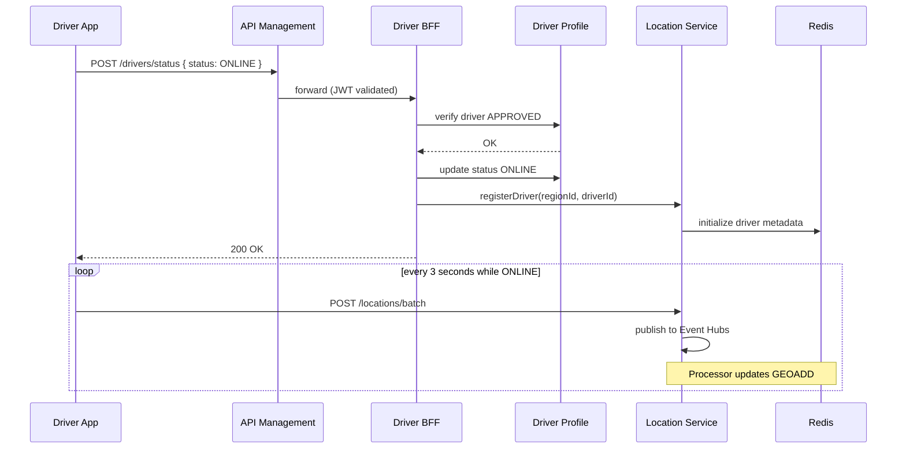
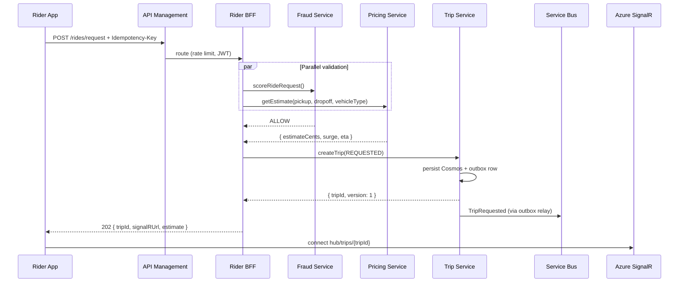
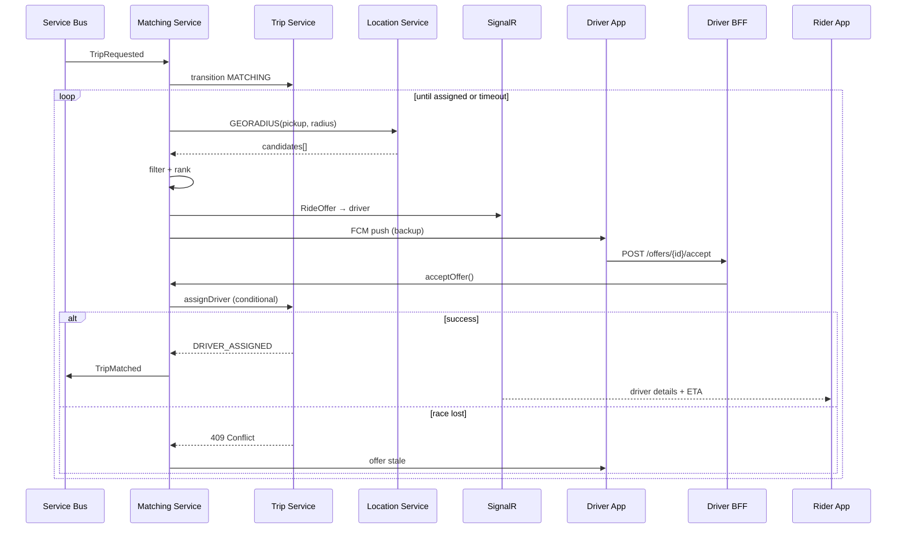
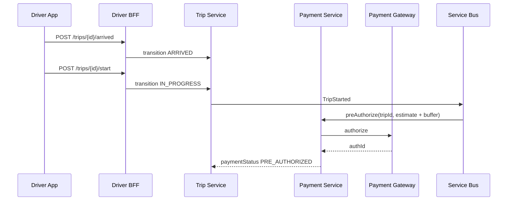
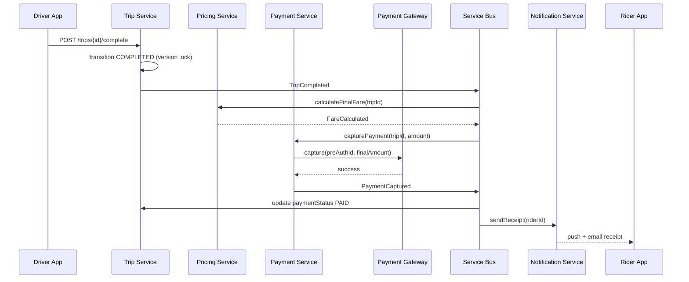

# Ride-Hailing Platform — Request Lifecycle and Integration Flows

| Field | Value |
|-------|-------|
| **Document ID** | ARCH-RHP-003 |
| **Version** | 1.0 |
| **Parent** | ARCH-RHP-001 |
| **Audience** | Integration engineers, QA, SRE, technical leads |

---

## 1. Purpose

This document describes **end-to-end integration flows** across the ride-hailing platform: every system hop from client action to downstream side effects. It is the authoritative reference for request lifecycle behavior, including failure and compensation paths.

---

## 2. Flow index

| Flow ID | Name | Trigger |
|---------|------|---------|
| FL-001 | Driver goes online | Driver toggles availability |
| FL-002 | Ride request (immediate) | Rider requests ride |
| FL-003 | Driver offer and acceptance | Matching dispatch |
| FL-004 | En route to pickup | Driver assigned |
| FL-005 | Trip start | Driver starts trip |
| FL-006 | Trip in progress | Rider on board |
| FL-007 | Trip completion and payment | Driver ends trip |
| FL-008 | Post-trip rating | Payment captured |
| FL-009 | Rider cancellation | Rider cancels |
| FL-010 | Driver cancellation | Driver cancels pre-start |
| FL-011 | Scheduled ride | Future pickup time |

---

## 3. FL-001 — Driver goes online

### 3.1 Sequence



### 3.2 Going offline

Driver sends `OFFLINE` → Driver Profile updates → Location Service removes driver from Redis GEO set within one heartbeat TTL cycle.

---

## 4. FL-002 — Ride request (immediate)

This is the **primary platform flow**. The synchronous API path ends at trip creation; matching is asynchronous.

### 4.1 Sequence



### 4.2 Synchronous API contract

```http
POST /api/v1/rides/request HTTP/1.1
Host: api.platform.example.com
Authorization: Bearer eyJ...
Idempotency-Key: req_unique_abc123
Content-Type: application/json

{
  "pickup": { "lat": 47.6062, "lng": -122.3321, "address": "400 Broad St" },
  "dropoff": { "lat": 47.6205, "lng": -122.3493, "address": "Space Needle" },
  "vehicleType": "STANDARD",
  "paymentMethodId": "pm_xyz"
}
```

**Response (202 Accepted):**

```json
{
  "tripId": "trip_8f3a2b",
  "status": "REQUESTED",
  "estimate": {
    "amountCents": 1850,
    "currency": "USD",
    "surgeMultiplier": 1.2,
    "durationSec": 1140
  },
  "realtime": {
    "signalRUrl": "wss://api.platform.example.com/hubs/trips",
    "accessToken": "..."
  }
}
```

### 4.3 Idempotency behavior

Duplicate `Idempotency-Key` within 24 hours returns the **same** `tripId` and status. No second trip is created.

### 4.4 Latency budget (sync path)

| Step | Budget |
|------|--------|
| APIM + JWT | 30 ms |
| Fraud + Pricing (parallel) | 80 ms |
| Trip create + outbox | 100 ms |
| Response serialization | 20 ms |
| **Total** | **≤ 300 ms p99** |

---

## 5. FL-003 — Driver offer and acceptance

Triggered by `TripRequested` event on Service Bus.

### 5.1 Sequence



### 5.2 Offer payload (SignalR → driver)

```json
{
  "type": "RIDE_OFFER",
  "offerId": "off_77",
  "tripId": "trip_8f3a2b",
  "pickup": { "lat": 47.606, "lng": -122.332, "address": "400 Broad St" },
  "dropoff": { "lat": 47.620, "lng": -122.349 },
  "estimatedEarningsCents": 1420,
  "pickupEtaSec": 240,
  "expiresAt": "2026-06-18T14:03:00Z"
}
```

### 5.3 Matching timeout

If no driver accepts within **45 seconds**, Matching Service calls `Trip.cancel(NO_DRIVERS_AVAILABLE)`. Rider receives notification via SignalR and push.

---

## 6. FL-004 — En route to pickup

### 6.1 State transitions

```text
DRIVER_ASSIGNED → (driver taps "Navigate") → DRIVER_EN_ROUTE
```

### 6.2 Location streaming to rider

```text
Driver App (3s interval)
  → Location Ingest → Event Hubs → Processor → Redis
  → Location Service publishes throttled update (max 1 per 3s)
  → SignalR group "trip:{tripId}" → Rider App map
```

### 6.3 ETA refresh

Every 30 seconds during `DRIVER_EN_ROUTE` and `IN_PROGRESS`, Location Service requests updated route ETA from Azure Maps and pushes `EtaUpdated` event to SignalR.

---

## 7. FL-005 — Trip start

### 7.1 Sequence



### 7.2 Geofence validation

Driver app may auto-suggest "Arrived" when within 50 meters of pickup. Server validates distance but does not hard-block start (urban GPS variance).

---

## 8. FL-006 — Trip in progress

| Activity | System behavior |
|----------|-----------------|
| Location streaming | Continues at 3s interval; distance accumulated via map-matched segments |
| Surge lock | Fare uses surge multiplier at **match time**, not current surge |
| Fraud monitoring | Stream processor flags impossible velocity jumps |
| Rider map | SignalR `DriverLocation` events throttled to 3s |

---

## 9. FL-007 — Trip completion and payment

### 9.1 Sequence



### 9.2 Payment saga states

```text
PRE_AUTHORIZED (at trip start)
  → CAPTURE_PENDING (on TripCompleted)
  → CAPTURED (PSP success)
  → PAID (ledger written)

Failure path:
  CAPTURE_PENDING → CAPTURE_FAILED → retry (3x exponential backoff)
    → still failed → OWED (block new rides for rider until resolved)
```

### 9.3 Fare calculation inputs

| Input | Source |
|-------|--------|
| Distance | Location Service accumulated map-matched meters |
| Duration | `startedAt` to `completedAt` |
| Base rate | Pricing Service SQL rules |
| Surge | Locked from trip document at match |
| Tolls | Optional manual adjustment / maps toll API |

---

## 10. FL-008 — Post-trip rating

Asynchronous, non-blocking on trip completion.

```text
PaymentCaptured → Notification prompts rider
Rider → POST /ratings { tripId, stars, comment }
Rating Service → persist → publish RatingSubmitted
Driver Profile consumer → update rolling average (eventual)
```

---

## 11. FL-009 — Rider cancellation

### 11.1 Fee policy

| Trip status at cancel | Rider fee |
|-----------------------|-----------|
| REQUESTED, MATCHING | None |
| DRIVER_ASSIGNED | Low cancellation fee |
| DRIVER_EN_ROUTE | Standard fee + partial driver compensation |
| ARRIVED | Full cancellation fee |

### 11.2 Sequence

```text
Rider → BFF → Trip.cancel(expectedVersion)
  → status CANCELLED
  → Service Bus TripCancelled
    → Matching: abort pending offers
    → Payment: charge fee or release pre-auth
    → Notification: notify driver if assigned
```

---

## 12. FL-010 — Driver cancellation

Allowed before `IN_PROGRESS`. Driver penalty applied to driver score.

```text
Driver → BFF → Trip Service
  Option A: re-queue → status MATCHING (new matching round)
  Option B: cancel trip → status CANCELLED (rider notified, can re-request)
```

Repeated cancellations trigger Fraud Service review.

---

## 13. FL-011 — Scheduled ride

```text
POST /rides/schedule { scheduledPickupAt, ... }
  → Trip created with status SCHEDULED

T-15 minutes before pickup:
  Service Bus scheduled message OR Durable Functions timer
    → transition REQUESTED
    → publish TripRequested
    → standard FL-002 matching flow begins
```

---

## 14. Real-time channel specification

### 14.1 Rider SignalR hub

| Group | Join condition | Events |
|-------|----------------|--------|
| `trip:{tripId}` | Rider owns trip | `StatusChanged`, `DriverLocation`, `EtaUpdated`, `DriverAssigned` |

### 14.2 Driver SignalR hub

| Group | Events |
|-------|--------|
| `driver:{driverId}` | `RideOffer`, `OfferRevoked`, `TripCancelled` |

### 14.3 Fallback

If WebSocket unavailable: client polls `GET /rides/{id}` every 5 seconds. Cached trip summary in Redis (2s TTL).

---

## 15. Error handling matrix

| Failure point | System response | User experience |
|---------------|-----------------|-----------------|
| Duplicate request (same idempotency key) | Return existing trip | Seamless |
| Fraud BLOCK | 403, no trip created | "Unable to request ride" |
| Trip create DB error | 503, client retry | "Try again" |
| Matching timeout | Trip → CANCELLED (NO_DRIVERS) | "No drivers available" |
| Driver accept race lost | 409 to driver | "Offer no longer available" |
| SignalR disconnect | Auto-reconnect + state sync | Brief map freeze |
| Maps API down | Haversine ETA fallback | Slightly less accurate ETA |
| Pre-auth fails at start | Block IN_PROGRESS transition | Driver prompted; rider fixes payment |
| Capture fails | Saga retry → OWED status | Receipt delayed; support notified |

---

## 16. Correlation and tracing

Every flow propagates:

| Field | Set at | Propagated via |
|-------|--------|----------------|
| `correlationId` | APIM (from header or generated) | HTTP headers, Service Bus message properties |
| `tripId` | Trip create | All downstream logs and traces |
| `regionId` | Trip create | Routing, metrics dimensions |

OpenTelemetry `traceparent` required on all internal HTTP and message publishes.

---

## 17. Related documents

| ID | Title |
|----|-------|
| ARCH-RHP-001 | Architecture Design Document |
| ARCH-RHP-002 | Services and Data Architecture |
| ARCH-RHP-004 | Azure Infrastructure Design |
| ARCH-RHP-005 | Reliability, Operations, and Observability |
